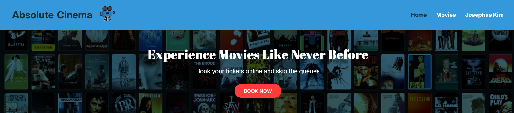
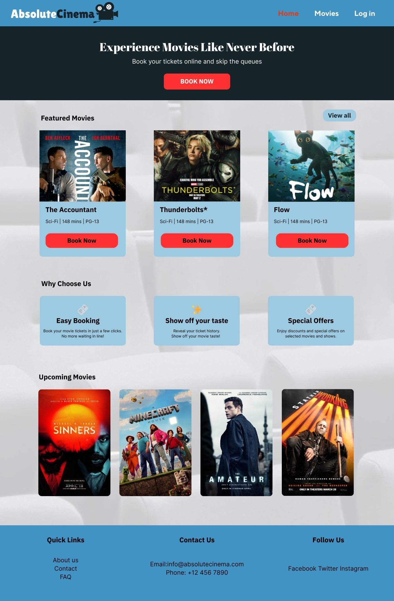
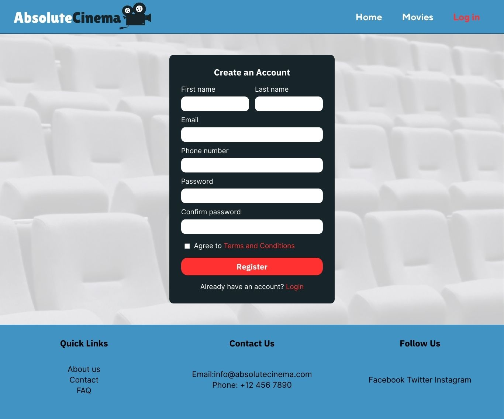
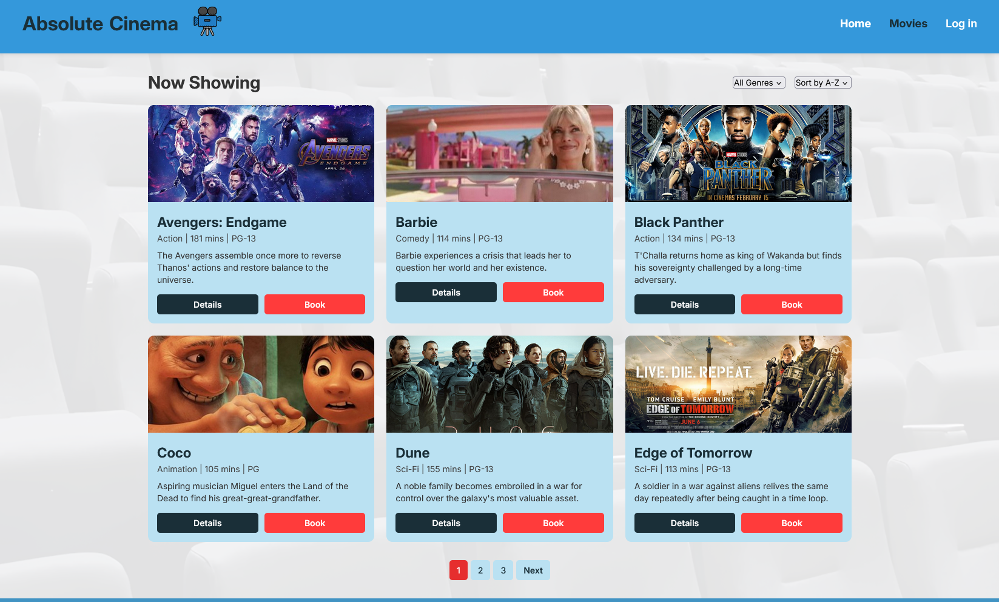
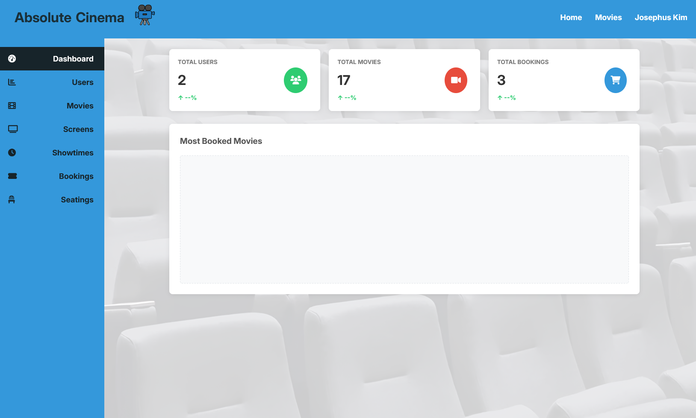
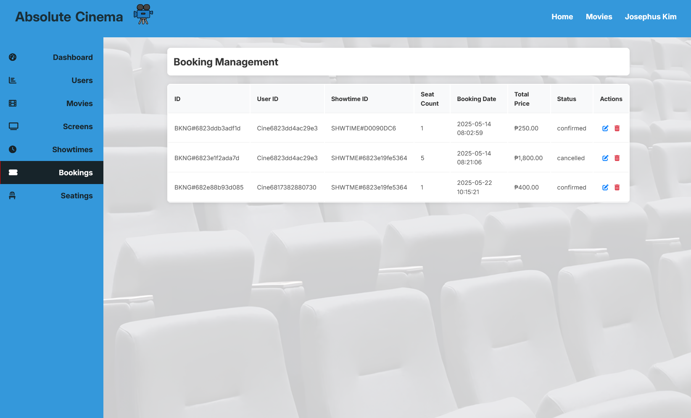

# 🎬 AbsoluteCinema

**AbsoluteCinema** is a web-based movie ticket booking system developed as a final project for our CC225 - Information Management course at Cebu Technological University.

## 📌 Project Overview

AbsoluteCinema was built to solve common issues in manual ticketing systems such as long queues, double bookings, and scheduling conflicts. The system supports both customer and admin roles:

- **Customers** can register, browse movies, view showtimes, check seat availability, book tickets, and view their booking history.
- **Admins** can manage movie records, screen configurations, showtimes, bookings, and user data through an intuitive dashboard.

---

## 👨‍💻 My Learning Journey

I started this project with very limited knowledge about PHP and databases. I searched *"PHP full course"* on YouTube and began learning the basics. With time and experimentation, especially on form handling and login systems, I was able to implement everything from the login page to a full admin dashboard.

Despite the project requiring only a basic login-logout flow, I went further and created full admin control features, UI translations from team designs, and functional user flows. This project made me realize I enjoy building full systems and interfaces.

---

## 🔑 Features

### For Customers:
- 📝 Register/Login
- 🎞️ View movies & details
- 🕒 View showtimes & seat availability
- 🎟️ Book seats and view history

### For Admins:
- 🎬 Manage movies, screens, showtimes, and users
- 📊 View and manage all bookings
- 🖥️ Admin dashboard interface

---

## 🖼️ Screenshots

### 🎥 Home Page  

### 🔐 Login Page  

### 🎫 Movie List / All Movies Page  

### 🧑‍💼 Admin Dashboard  

### 🧾 Admin – Bookings Page  

---

## 🛠 Tech Stack

- **Frontend:** HTML, CSS, JavaScript  
- **Backend:** PHP  
- **Database:** MySQL  

---

## 📚 What I Learned

- PHP form handling, sessions, and database connections
- SQL CRUD operations and database schema design
- Admin-user role management
- Responsive design and UX
- How to bring ideas to life, even from scratch

---

## 👥 Team Members

- Kristh Alner Berame  
- John Melbur Jr. Cabiso  
- Franz Dominic Condes  
- Renz Kayne Luab  
- Sherilyn Sanchez  
- **Josephus Kim Sarsonas** *(me)*  
- Shen Kylle Taguisa  

---

## 📂 Repository

👉 [https://github.com/baphus/AbsoluteCinema](https://github.com/baphus/AbsoluteCinema)

---

> 💬 *"It’s not perfect, but it’s a solid start."*  
> I’m excited to build more and learn along the way.
